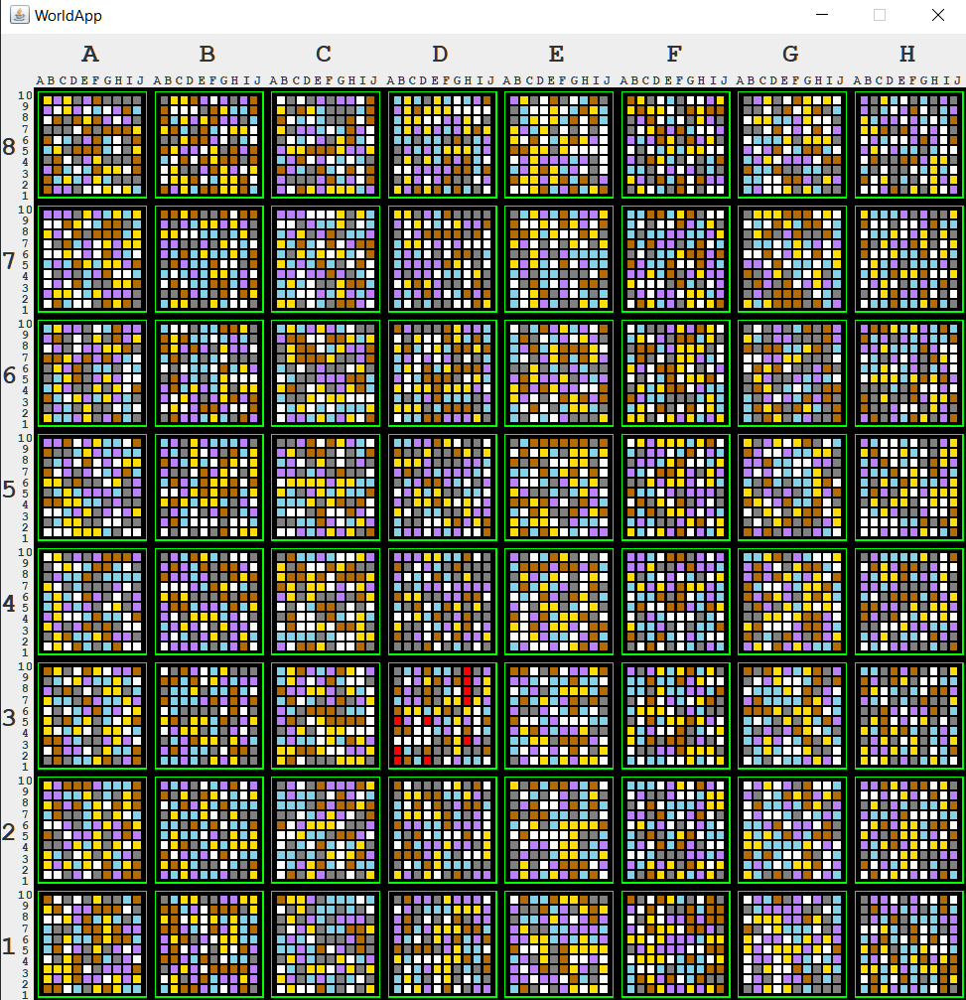
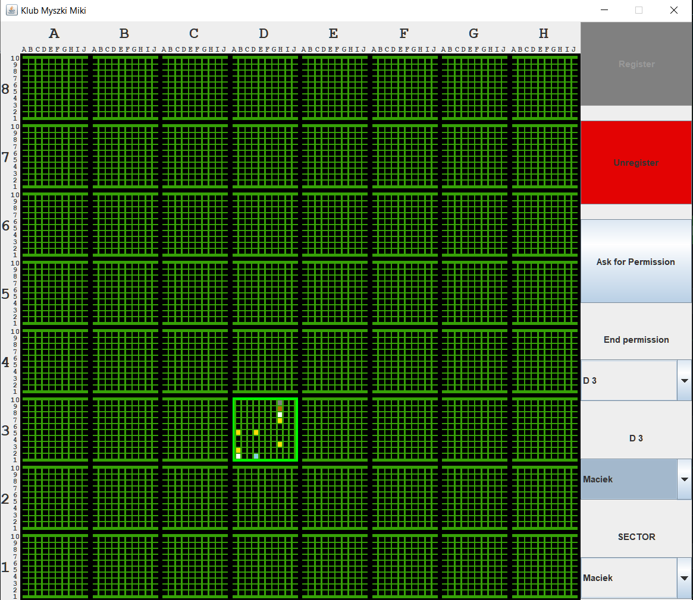
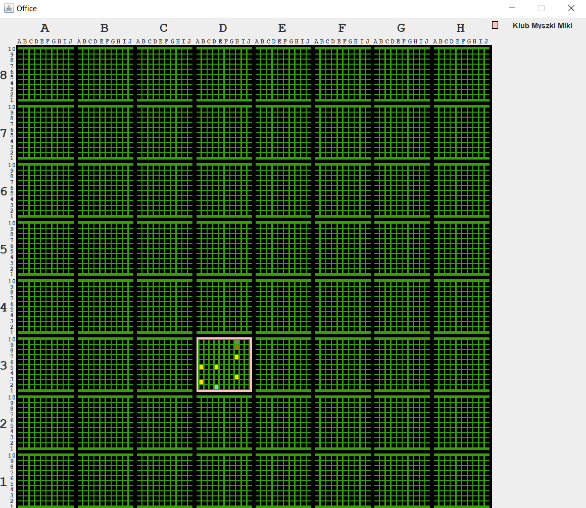
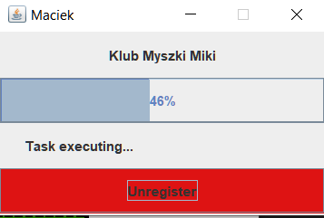

# Lab7-RMI
Celem programu była nauka RMI w Javie, za pomocą stworzenia 4 programów, które symulowały poszukiwania skarbów:

-WorldApp: interfejs, który przedstawia cały świat ze skarbami,

-ClubApp: interfejs, który przedstawia widok danego klubu. W klubie mogą być zarejestrowani poszukiwacze, którzy są wysyłani przez klub na poszukiwania,

-OfficeApp: interfejs, który przedstawia widok urzędu, w którym są zarejstrowane kluby. W urzędzie widać tylko odnalezione skarby.

-SeekerApp: program do inicjalizacji poszukiwacza, który może zarejestrować się w wybranym klubie, a następnie oczekuje na rozkaz ze stronu wybranego klubu.

